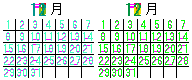

# pixelart

Convert calendar graph SVG to pixel art

source Graph SVG for Calendar(for example, GitHub and [Pixela](https://pixe.la))


and Image, Convert to pixel art

- 
 →

- 
 →


this PSD image

- 
 →


## Installation

```
$ go get github.com/wordijp/pixelart
```

## Requirement

- [ajstarks/svgo](https://github.com/ajstarks/svgo)
- [vmihailenco/msgpack](https://github.com/vmihailenco/msgpack)
- [wordijp/svgparser](https://github.com/wordijp/svgparser)
	- forked) [JoshVarga/svgparser](https://github.com/JoshVarga/svgparser)
- [oov/psd](https://github.com/oov/psd)

## Usage


```go
import "github.com/wordijp/pixelart/graph"
import "github.com/wordijp/pixelart/dot"

func ExampleConvertPrint() {
	var g graph.Data
	{
		file, _ := os.Open("calendar-graph.svg")
		defer file.Close()
		g, _ = graph.ParseCalendarGraphSvg(file)
	}
	
	var d dot.Data
	{
		file, _ := os.Open("dot-vim.png")
		defer file.Close()
		d, _ = dot.ParseDotPng(file)
	}
	
	buf := bytes.NewBuffer(nil)
	d.Convert(g).WriteSvgString(buf)

	fmt.Println(buf.String())
}
```

and see example

## License

The MIT License.
